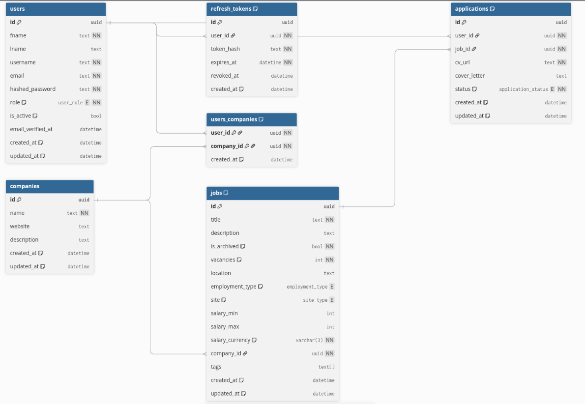

## Scope

### Goals

A REST API that supports:
1. Authentication and session management using refresh tokens
1. Support for two user types: regular users and recruiters
1. Job search functionality
1. Job application submission
1. Application status management
1. Company management and recruiter membership handling

### Non-goals

1. Frontends
1. Post-application lifecycle: anything beyond initial application advancement (e.g., interview scheduling, offers).
1. Free-text search for jobs
1. Localization (languages other than English)

## API Conventions

- Base path: /api/v1
- IDs: UUIDv4 strings
- Time: ISO-8601 UTC
- Pagination: page_size (default 20, max 100), page_token (cursor). Responses include next_page_token.

## Data Model

The following data model is defined in DBML in the file [dbml.txt]()

## Endpoints

### Auth

POST   /auth/signup
POST   /auth/verify-email  
POST   /auth/login
POST   /auth/refresh       # rotates refresh, returns new access
POST   /auth/logout        # revokes current refresh

### Users

GET    /users/me  # Get own data
PATCH  /users/me  # Modify own data

### Jobs

#### Regular Users Use Cases

GET    /jobs                        # filters: title, location, employment_type, site, salary_min/max, company, tags
GET    /jobs/{job_id}

#### Recruiter Use Cases

POST   /jobs                        # body includes company_id
PATCH  /jobs/{job_id}               # update (only if not archived)
POST   /jobs/{job_id}/archive
DELETE /jobs/{job_id}
GET    /companies/{company_id}/jobs # same filters; requires membership

### Applications

#### Regular Users Use Cases

POST   /jobs/{job_id}/apply         # creates application (enforces 1 per user/job)
GET    /applications/me             # list my apps (filters: status, company, tags)
GET    /applications/{application_id}
PATCH  /applications/{application_id}         # edit CV/cover_letter (only if submitted)
POST   /applications/{application_id}/cancel  # only if submitted

#### Recruiter Use Cases

GET    /companies/{company_id}/applications  # filters: status, job_id, date
POST   /applications/{application_id}/status # body: { "action": "receive" | "advance" | "reject" }

### Companies

GET /companies/{company_id}
GET /companies/{company_id}/members
POST   /companies
POST   /companies/{company_id}/members       # add recruiter (body: user_id)
DELETE /companies/{company_id}/members/{user_id}

## Deployment

One container for the API and one for the DB, all hosted on one virtual machine. May be adjusted in the future.